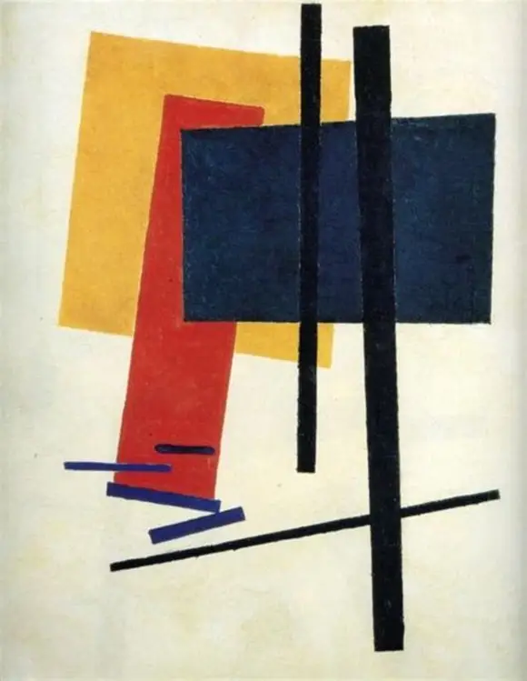
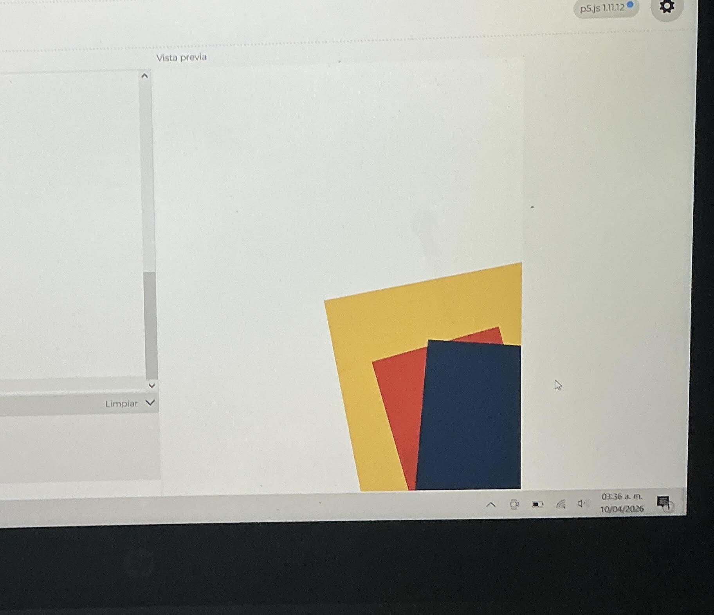
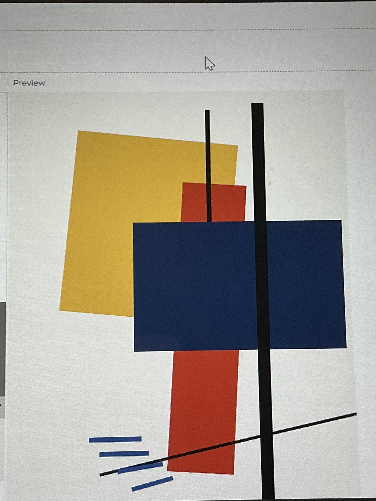
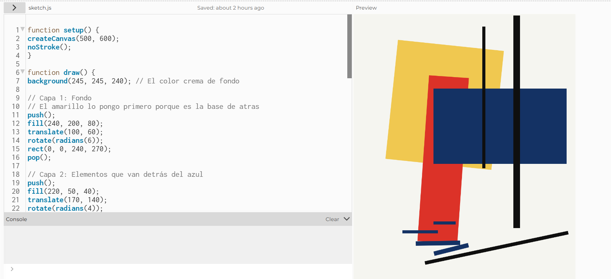

**SOLEMNE 1**

**Obra:** Realismo pictórico de un futbolista - masas de color en la cuarta dimensión.

**Autor**: Kazimir Malévich

**Año**: 1915

**Estilo**: Suprematismo

--------

Elegí la obra “Realismo pictórico de un futbolista” de Kazimir Malevich porque me llamó mucho la atención formas geométricas, buscaba algo que tuviera más movimiento visual y distintas direcciones que se cruzaran.

Lo que más me interesó fue  hay una barra negra vertical que atraviesa la composición, y al mismo tiempo aparece una línea diagonal abajo. 

Como recién estoy empezando senti que intentar recrear este tipo de composición mediante código me interesaba probar si podía lograr la similitud a la obra original, sobre todo los colores  y  la posición de cada forma aunque sea mínima cambia completamente la fuerza visual de la imagen.

-----

Para empezar, tuve que mirar la obra como si fueran capas, lo hice al princiipio mentalmente y luego fui boceteando
Identifiqué que todo eran cuadriláteros
traté de buscar unos tonos más parecidos a la pintura real, que es como un color crema al fondo y colores más opacos, sobre todo el azul que es bastante oscuro, azul marino.

**Coordenadas**: Esto fue lo más difícil. Me puse a pensar el plano X e Y y luego fui busvando referencias en internet dónde poner cada cosa. Usé mucho el comando rect() y me acostumbré a que el orden en que escribo el código es el orden en que aparecen las cosas (lo que escribo al final tapa a lo que escribí al principio) como las capas. y me parecio muy interesante la verdad

-------

**Errores**

**Aquí fue donde más tiempo aprendí**

Al principio puse el código del rectángulo azul antes que el rojo, y el rojo lo tapaba completo. Estuve confundida pero por poco hasta que recordé que tenía que mover bloques enteros de código hacia arriba para que el azul quedara encima del rojo, tal como en el cuadro original.

Cuando quise inclinar el rectángulo rojo y el amarillo, usé rotate() y se me movió todo el dibujo fuera de la pantalla. No entendía por qué pasaba eso. Después de varias pruebas fallidas (y de que casi se me borrara todo), aprendí que tenía que usar push(), translate() y pop(). Fue como aprender un truco nuevo para que la rotación se quedara en su lugar y no afectara a las otras figuras.

El ajuste de las líneas azules, Las barritas de abajo me quedaron  muy arriba al principio. Tuve que ir cambiando los números de la coordenada Y de a poco hasta que quedaron bien abajo, casi tocando la línea negra del fondo.

Acá fue cuando iba poniendo los cuadrilateros e ir probando los colores, las posiciones y coordenadas.

Gran avance, algunas figuras se sobre pusieron de otras, pero se solucionaba facil ya que fui repasando en ocasiones.

----------

**Aprendizajes**

Lo más importante que aprendí en p5.js es que el orden importa muchísimo. También aprendí que no basta con poner las coordenadas, hay que tener mucha paciencia para ir probando y ajustando los ángulos hasta que la composición se vea bien y equilibrada. Al final, lo que parece simple terminó siendo un ejercicio de mucha observación y sobre todo las capas para que cada pieza encajara en su lugar.

**RESULTADO FINAL.** (semifinal) debo alargar el rectangulo negro que esta en la posición de al frente.

y en conclusión sste trabajo me sirvió mucho para darme cuenta de que programar no es solo tirar números, sino que también sirve para crear cosas visuales muy bonitas. Recrear esta obra me hizo fijarme en muchos detalles detalles de las cosas.

También aprendí a usar translate() y rotate(), que al principio me costaron un montón, pero ahora entiendo que son básicos para poder "inclinar" las cosas sin que se desarmen.

Al final, este ejercicio me ayudó a perderle el miedo a p5.js lo importante es ir probando y ajustando de a poco, Fue entretenido ver cómo algo que empezó como una página en blanco terminó siendo una obra de arte solo usando código.

-----------

**CODIGOS**

// para escribir en p5.js

Código	Función

setup()	Se ejecuta una vez

draw()	Se repite continuamente

createCanvas()	Crea el lienzo

background()	Borra/dibuja el fondo

ellipse()	Dibuja círculos

----------------
**Codigos usados en p5.js**

-------
function setup() {
createCanvas(500, 600);
noStroke();
}

function draw() {
background(245, 245, 240); // El color crema de fondo

// Capa 1: Fondo
// El amarillo lo pongo primero porque es la base de atras
push();
fill(240, 200, 80);
translate(100, 60);
rotate(radians(6));
rect(0, 0, 240, 270);
pop();

// Capa 2: Elementos que van detrás del azul
push();
fill(220, 50, 40);
translate(170, 140);
rotate(radians(4));
rect(0, 0, 90, 375);
pop();

// --- Capa 3: El Azul Central (Base) ---
// Este bloque es el que tapa a los de atras
fill(20, 50, 100);
rect(180, 170, 300, 170);

// --- Capa 4: arriba del azul, barra negra
fill(15, 15, 15);
rect(360, 5, 15, 480);
  
  // Esta barrita negra fina de la izquierda tambien va detras
fill(15, 15, 15);
rect(290, 120, 7, 320);

// linea negra em diagonal
push();
fill(15, 15, 15);
translate(160, 560);
rotate(radians(-12));
rect(0, 0, 330, 8);
pop();

// --- Capa 5: Detalles finales (Las barritas azules)
fill(20, 50, 100);

// Barra 1 
rect(180, 470, 50, 7);

// Barra 2 
rect(110, 490, 80, 7);

// Barra 3 
push();
translate(140, 515);
rotate(radians(-1));
rect(0, 0, 100, 10);
pop();

// Barra 4 
push();
translate(180, 538);
rotate(radians(-14));
rect(0, 0, 80, 10);
pop();
}

rect()	Dibuja rectángulos

fill()	Cambia el color
![mi imagen](nombredelarchivo cerrar con parentesis

mouseX, mouseY	Posición del mouse

-Camila Romo
